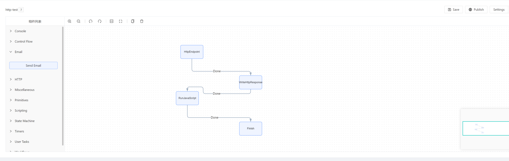
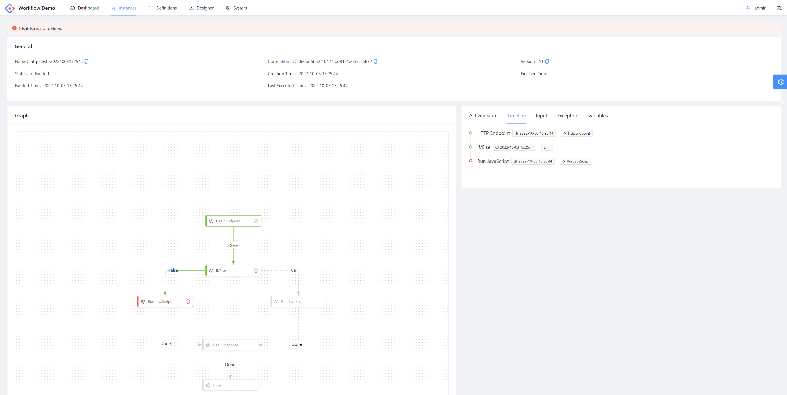
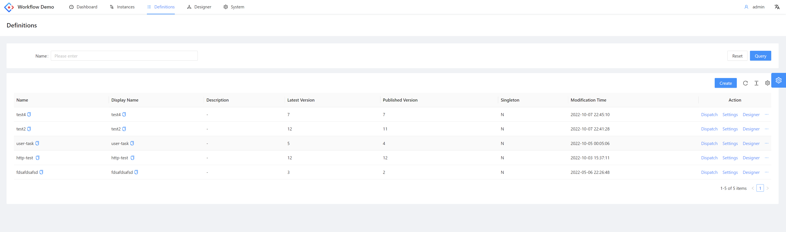
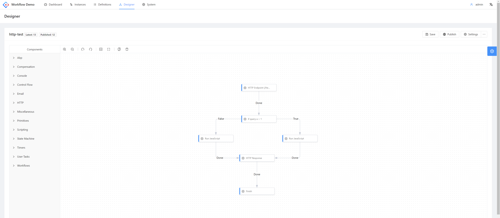
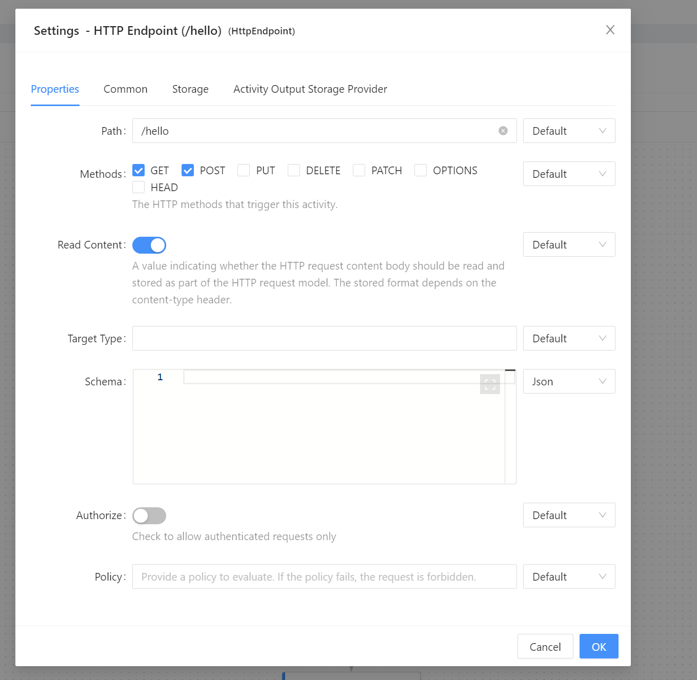
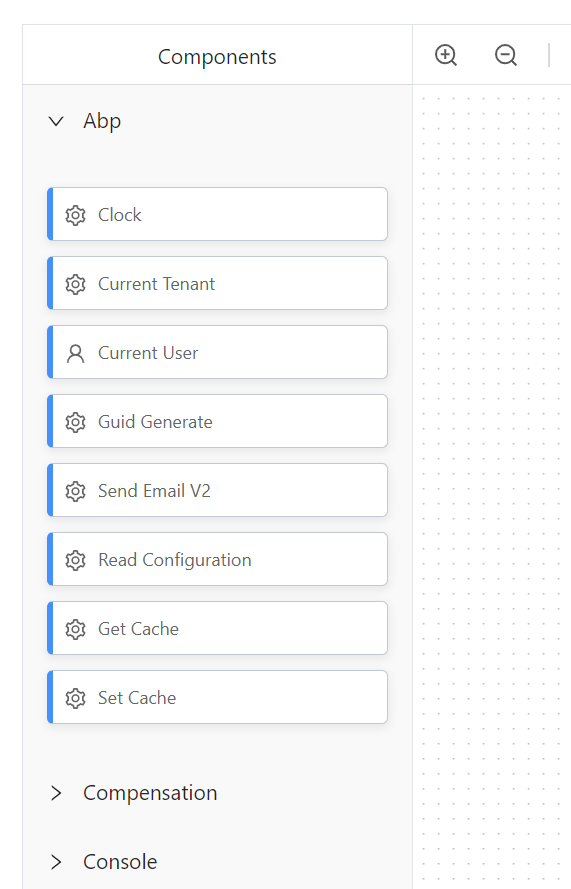
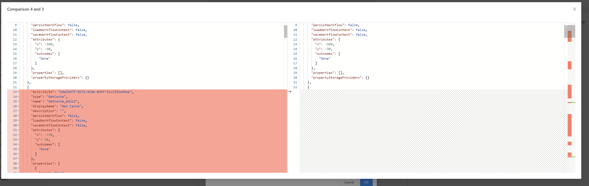
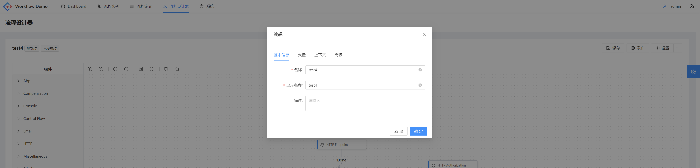

# Abp & Elsa & Designer

Elsa module integration for abp. 

## What's new

- Adapter elsa store to abp repository (entityframework & mongodb)
- New graph designer system 
- History version list & version comparison
- New activities
  - [ ] BlobStoring (Read,Write,Delete)
  - [x] Caching (Read,Write)
  - [x] Configuration (Read)
  - [x] Emailing (integrated with abp user&role system)
  - [ ] EventBus (Publish,Subscribe,Unsubscribe)
  - [ ] String decryption & encryption
  - [ ] Setting (Read,Write)
  - [x] Clock
  - [x] Current tenant
  - [x] Current user
  - [x] Guid generate
  - [x] Http authorization
  - [ ] Send sms

## Screenshots

#### Instances

#### Instance detail

#### Definitions

#### Designer

#### Activity settings

#### New activities

#### Version comparison

#### definition setting (change language)

## Demo site

TODO
